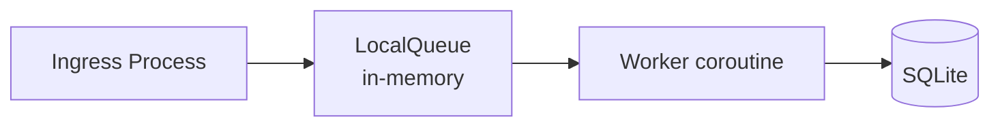
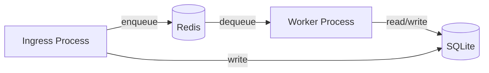

# Architecture Design: Redis Queue Adapter + JobQueueBackend Protocol

- Status: Draft
- Date: 2026-05-10
- Related ADR: ADR-011 (Single-Host SQLite and Redis Runtime Target)
- Review reference: Architecture Review 2026-05-10 — Mod2 (queue backend missing Protocol)

---

## 1. Problem Statement

MergeMate today uses `LocalQueue`, an in-memory `asyncio.Queue` wrapper, as its only queue backend. Per ADR-011, the single-host split-runtime target requires a Redis-backed queue transport for true process separation between ingress and worker. The architecture review (Mod2) also flagged that `JobQueueBackend` has no formal Protocol — `LocalQueue` satisfies it by duck typing only, which blocks swappable backends.

**What's already done** (since the review):
- A `JobQueueBackend` Protocol now exists at `src/mergemate/infrastructure/queue/__init__.py` with `enqueue()`, `dequeue()`, and `acknowledge()`.
- `LocalQueue` explicitly implements it via `@override`.

**What remains:**
1. A `RedisQueue` implementation that satisfies the same Protocol.
2. Configuration plumbing (`queue.backend: "local" | "redis"`).
3. Startup reconciliation for stale queued/leased jobs after a crash.
4. A dedicated `worker.py` entrypoint that boots with the Redis queue only.

---

## 2. JobQueueBackend Protocol (current state + proposed changes)

### Current Protocol (line by line)

```python
# src/mergemate/infrastructure/queue/__init__.py
@runtime_checkable
class JobQueueBackend(Protocol):
    def enqueue(self, job_id: str) -> bool: ...
    async def dequeue(self) -> str: ...
    def acknowledge(self, job_id: str) -> None: ...
```

### Issue: Mixed async/sync signatures

| Method | Signature | Call site |
|--------|-----------|-----------|
| `enqueue` | sync `def` | Called from sync `RunDispatcher.dispatch_run()` — correct |
| `dequeue` | `async def` | Called from async `BackgroundRunWorker._consume_loop()` — correct |
| `acknowledge` | sync `def` | Called from sync `lambda _:` in `BackgroundRunWorker.enqueue()` callback — works but awkward |

### Decision: Keep Protocol signatures as-is

Why:
- `enqueue()` and `acknowledge()` are fast, non-blocking operations in both `LocalQueue` (O(1) dict ops) and Redis (sub-ms network round-trip). Making them `async def` would force `RunDispatcher` (a sync class) into async for no benefit.
- `dequeue()` **must** be async because it blocks waiting for work — both `asyncio.Queue.get()` and Redis `BLPOP` need to yield the event loop.
- The mixed-signature pattern follows the real-world I/O profile: *enqueue/acknowledge are fire-and-forget; dequeue is blocking*.

### Protocol stays as-is. RedisQueue implements the sync methods via `redis-py`'s synchronous client where possible and uses `asyncio.to_thread()` only for the blocking `dequeue`.

---

## 3. RedisQueue Implementation Design

### 3.1 Dependencies

- `redis` (redis-py) — synchronous and async clients available
- No framework-specific Redis library (avoid `aioredis` — redis-py ≥4.0 ships its own async support)

### 3.2 Data Model

The Redis queue uses two key families per queue name:

```
Key                               | Type    | Purpose
----------------------------------|---------|------------------------
mergemate:queue:{name}:jobs       | List    | FIFO queue of job_id strings
mergemate:queue:{name}:leases     | Hash    | job_id → worker_id for in-flight jobs
mergemate:queue:{name}:lease_ttl  | Set     | job_ids with active leases (checked during dequeue)
```

This mirrors the lease semantics of the existing `RunJobRepository` (SQLite) but at the Redis transport layer. The **SQLite run_jobs table remains the source of truth** — Redis is a fast signalling channel.

### 3.3 Class Sketch

```python
class RedisQueue:
    """Redis-backed durable queue. Satisfies JobQueueBackend Protocol."""

    def __init__(
        self,
        redis_url: str = "redis://localhost:6379/0",
        queue_name: str = "default",
        lease_seconds: int = 30,
    ) -> None:
        self._client = redis.Redis.from_url(redis_url, decode_responses=True)
        self._queue_name = queue_name
        self._queue_key = f"mergemate:queue:{queue_name}:jobs"
        self._leases_key = f"mergemate:queue:{queue_name}:leases"
        self._lease_ttl_key = f"mergemate:queue:{queue_name}:lease_ttl"
        self._lease_seconds = lease_seconds

    def enqueue(self, job_id: str) -> bool:
        """Redis RPUSH. Returns False if job already leases (de-dupe)."""
        # Check lease set first (fast local check via EXISTS + SISMEMBER)
        if self._client.sismember(self._lease_ttl_key, job_id):
            return False
        # Also check if already queued (list contains)
        # NOTE: RPUSH + SADD combo; use Lua script for atomicity
        lua = """
        local exists = redis.call('SISMEMBER', KEYS[2], ARGV[1])
        if exists == 1 then return 0 end
        redis.call('RPUSH', KEYS[1], ARGV[1])
        redis.call('SADD', KEYS[2], ARGV[1])
        redis.call('EXPIRE', KEYS[2], KEYS[3])
        return 1
        """
        return bool(self._client.eval(lua, 3, self._queue_key, self._lease_ttl_key, self._lease_seconds, job_id))

    async def dequeue(self) -> str:
        """BLPOP with timeout. Blocks until a job is available."""
        # BLPOP blocks the connection — run in executor to avoid blocking the event loop
        def _blocking_pop():
            result = self._client.blpop(self._queue_key, timeout=0)  # 0 = indefinite
            if result is None:
                # Timeout should not happen with timeout=0, but handle defensively
                raise RuntimeError("Redis BLPOP timed out unexpectedly")
            _, job_id = result
            # Remove from lease-ttl set once dequeued (worker ack will handle lease cleanup)
            self._client.srem(self._lease_ttl_key, job_id)
            return job_id

        return await asyncio.to_thread(_blocking_pop)

    def acknowledge(self, job_id: str) -> None:
        """Remove lease tracking for a completed job."""
        self._client.hdel(self._leases_key, job_id)
        self._client.srem(self._lease_ttl_key, job_id)
```

### 3.4 Design Decisions

| Decision | Choice | Rationale |
|----------|--------|-----------|
| Sync `enqueue`/`acknowledge` | `def` not `async def` | Matches Protocol; redis-py sync calls are fast (<1ms); avoids forcing `RunDispatcher` async |
| Atomic de-dupe | Lua script | Avoids TOCTOU between SISMEMBER and RPUSH in `enqueue` |
| `dequeue` in executor | `asyncio.to_thread()` | `BLPOP` blocks the Redis connection — must not block the event loop |
| Queue name | Configurable, defaults to `"default"` | Supports future multi-worker queues (e.g., separate queue per workflow type) |
| Decode responses | `decode_responses=True` | Job IDs are strings; saves manual `.decode()` at every call site |
| Connection model | Single shared `redis.Redis` client | redis-py handles connection pooling internally; no need for connection-per-call |
| Lease tracking at Redis | Optional / advisory | SQLite `run_jobs` table is the authoritative lease source; Redis lease set is a fast pre-filter to reject re-enqueue of in-flight jobs |

---

## 4. Configuration Schema

### 4.1 New Config Section

```python
class QueueConfig(BaseModel):
    """Queue backend configuration."""
    backend: Literal["local", "redis"] = "local"
    redis_url: str = "redis://localhost:6379/0"
    queue_name: str = "default"
    lease_seconds: int = 30  # default, overridable by runtime.job_lease_seconds
```

### 4.2 Changes to AppConfig

```python
class AppConfig(BaseModel):
    ...
    queue: QueueConfig = Field(default_factory=QueueConfig)
    ...
```

No `model_validator` changes needed — default is `local`, backward compatible.

### 4.3 YAML Example

```yaml
# config.yaml — Redis queue mode
queue:
  backend: redis
  redis_url: "redis://localhost:6379/0"
  queue_name: mergemate-jobs

# Fallback defaults (explicit):
# queue:
#   backend: local
```

---

## 5. Bootstrap Integration

### 5.1 Queue Factory Logic

```python
# In bootstrap() function, replace:
#   queue_backend = LocalQueue()
# with:

def _create_queue_backend(settings: AppConfig) -> JobQueueBackend:
    if settings.queue.backend == "redis":
        return RedisQueue(
            redis_url=settings.queue.redis_url,
            queue_name=settings.queue.queue_name,
            lease_seconds=settings.runtime.job_lease_seconds,
        )
    return LocalQueue()
```

### 5.2 Worker Startup

When running in split mode (separate worker process), the worker boots with:

```python
def bootstrap_worker(config_path: Path | None = None) -> BackgroundRunWorker:
    """Bootstrap a Redis-only worker. No Telegram, no lifecycle notifier."""
    settings = load_runtime_settings(config_path)
    configure_logging(settings.logging.level)

    database = SQLiteDatabase(settings.resolve_database_path(config_path))
    database.initialize()

    run_repository = SQLiteRunRepository(database)
    run_job_repository = SQLiteRunJobRepository(database)

    # ── Startup reconciliation ──────────────────────────────────────
    reconcile_stale_jobs(run_job_repository)

    # ── Queue (always Redis for standalone worker) ──────────────────
    queue_backend = RedisQueue(
        redis_url=settings.queue.redis_url,
        queue_name=settings.queue.queue_name,
        lease_seconds=settings.runtime.job_lease_seconds,
    )

    # ── Core dependencies (no Telegram, no lifecycle notifier) ──────
    # ... LLM clients, services, orchestrator similar to bootstrap() ...

    worker = BackgroundRunWorker(
        orchestrator=orchestrator,
        run_repository=run_repository,
        run_job_repository=run_job_repository,
        queue_backend=queue_backend,
        submit_prompt=submit_prompt_use_case,
        lifecycle_notifier=...  # placeholder / no-op notifier
        max_concurrent_runs=settings.runtime.max_concurrent_runs,
        lease_seconds=settings.runtime.job_lease_seconds,
        heartbeat_interval_seconds=settings.runtime.job_heartbeat_interval_seconds,
    )
    return worker
```

### 5.3 Worker Entrypoint

```python
# src/mergemate/worker.py

async def main() -> None:
    import argparse
    parser = argparse.ArgumentParser()
    parser.add_argument("--config", type=Path, default=None)
    args = parser.parse_args()

    worker = bootstrap_worker(config_path=args.config)
    await worker.start()

    # Block until SIGTERM/SIGINT
    stop_event = asyncio.Event()
    loop = asyncio.get_event_loop()
    for sig in (signal.SIGTERM, signal.SIGINT):
        loop.add_signal_handler(sig, stop_event.set)
    await stop_event.wait()

    await worker.stop()


if __name__ == "__main__":
    asyncio.run(main())
```

---

## 6. Startup Reconciliation Design

### 6.1 The Problem

When a worker crashes:
- SQLite `run_jobs` may still have rows in `queued` or `running` (leased) status.
- Redis may still have job IDs in its list or lease set.
- After restart, the new worker must **reconcile** stale state so jobs don't leak.

### 6.2 Reconciliation Rules

| Status in SQLite | Redis state | Action |
|-----------------|-------------|--------|
| `queued` | Job exists in list | No action — will be dequeued normally |
| `queued` | Job missing from list | Re-enqueue the job_id into Redis |
| `running` (expired lease) | Job exists in lease set | Release lease, re-enqueue, transition back to `queued` |
| `running` (active lease) | — | Skip — another worker holds it (wait for lease expiry) |
| `completed / failed` | Job exists in list | Remove from Redis (stale, should never happen but guard) |

### 6.3 Implementation Sketch

```python
def reconcile_stale_jobs(
    run_job_repository: SQLiteRunJobRepository,
    queue_backend: RedisQueue,
    *,
    worker_id: str,
    lease_seconds: int,
) -> int:
    """Return count of jobs reconciled."""
    stale_queued = run_job_repository.find_stale_queued_jobs()
    stale_running = run_job_repository.find_stale_running_jobs(
        worker_id=worker_id,
        lease_seconds=lease_seconds,
    )

    reconciled = 0
    for job in stale_queued:
        queue_backend.enqueue(job.job_id)
        reconciled += 1

    for job in stale_running:
        run_job_repository.release_lease(job.job_id)
        queue_backend.enqueue(job.job_id)
        reconciled += 1

    return reconciled
```

The `find_stale_running_jobs()` query looks for jobs whose last heartbeat is older than `now - lease_seconds` and whose `worker_id` matches no active worker. (In a single-worker setup, all stale `running` jobs with expired leases are reclaimable.)

### 6.4 When to Run

- **Always** at the start of `bootstrap_worker()` and at the start of the ingress process's worker startup.
- **Optionally** on a cron-like schedule inside the worker (e.g., every 60 seconds) to handle the case where a job's lease expires while the worker is alive but some internal deadlock prevents it from cleaning up.

### 6.5 Safety: Dual-Writer Risk

In split-mode operation, the **ingress process** writes to Redis (enqueue) and the **worker process** reads from Redis (dequeue + acknowledge). Reconciliation runs in the worker process because it holds the SQLite `run_jobs` authority. The ingress process does **not** reconcile — it only enqueues.

If both processes run reconciliation simultaneously (e.g., on a shared filesystem), the SQLite WAL mode handles concurrent reads; the `release_lease` + `enqueue` pair is not atomic across processes but the worst outcome is a duplicate enqueue (caught by RedisQueue.enqueue's duplicate check).

---

## 7. Integration Points with Existing Architecture

### 7.1 What Stays the Same

- `RunDispatcher` — unchanged, still receives `JobQueueBackend` via constructor injection.
- `BackgroundRunWorker` — unchanged, still receives `JobQueueBackend` via constructor injection.
- `ServiceContext.queue_backend` — typed as `JobQueueBackend`, already satisfied by `LocalQueue`, will also accept `RedisQueue`.
- `MergeMateRuntime.queue_backend` property — unchanged, delegates to `ServiceContext`.

### 7.2 What Changes

| File | Change | Risk |
|------|--------|------|
| `src/mergemate/config/models.py` | Add `QueueConfig` model + `queue` field on `AppConfig` | Low — no validator changes |
| `src/mergemate/infrastructure/queue/__init__.py` | No change — Protocol already defined | None |
| `src/mergemate/infrastructure/queue/redis_queue.py` | New file — `RedisQueue` class | Low — self-contained with `redis-py` |
| `src/mergemate/bootstrap.py` | Queue factory logic: `_create_queue_backend()` | Low — simple if/else |
| `src/mergemate/worker.py` | New file — standalone worker entrypoint | Low — thin CLI wrapper |
| `docs/architecture/02-runtime-architecture.md` | Update section on queue backend selection | None (docs only) |

### 7.3 What Does NOT Change

- `src/mergemate/infrastructure/queue/local_queue.py` — stays as default backend.
- `BackgroundRunWorker`, `RunDispatcher`, `RunJobRepository` — no API changes.
- The unit test fixtures that use `LocalQueue` — no changes needed.
- SQLite remains the system of record for run/job state (ADR-011 invariant).

---

## 8. Deployment Model

### Single-Process (Default, MVP)



- No Redis required.
- `queue.backend: local` (default).
- Works out of the box with no additional infrastructure.

### Split-Process (Target, ADR-011)



- Both processes share the same SQLite database file (WAL mode, busy timeout).
- Ingress process runs `bootstrap()` as today but with `queue.backend: redis`.
- Worker process runs `worker.py` with Redis-only queue and SQLite persistence.
- Startup reconciliation in the worker handles stale jobs after crash.

### Requirements for Split-Process

1. SQLite must be in WAL mode (already in `SQLiteDatabase.initialize()`).
2. SQLite busy timeout must be set high enough for concurrent access (e.g., 5000ms).
3. Both processes must run on the same host (shared filesystem for SQLite).
4. Redis must be running locally or on a nearby host (sub-ms latency expected).

---

## 9. Error Handling and Edge Cases

### 9.1 Redis Connection Failure on Startup

If Redis is unreachable at `RedisQueue.__init__()`, the error propagates to `bootstrap()` which logs the failure and exits. This is correct — the operator should configure Redis or fall back to `local`.

### 9.2 Redis Connection Loss Mid-Operation

- `enqueue()`: Raises `redis.exceptions.ConnectionError`. The caller (`RunDispatcher`) does not catch this — it should bubble up to the ingress handler which responds with a 500-style error.
- `dequeue()`: Transient failures retry via Redis client's retry mechanism. Persistent failures crash the `_consume_loop()` coroutine.
- `acknowledge()`: Best-effort. If Redis is down, the job is acknowledged in SQLite but remains in Redis. Reconciliation on next worker start cleans it up.

### 9.3 Duplicate Job After Crash

Scenario: Worker crashes between `dequeue()` and `acknowledge()`. Redis still has the job in its list (not acknowledged, not in lease set). On restart, reconciliation picks up the job from SQLite's `queued` rows and re-enqueues it. The worker processes it again. This is acceptable because:
- The job lifecycle in SQLite is the authoritative source (RUNNING → FAILED or COMPLETED).
- SQLite's `ensure_queued_job()` already prevents duplicate queuing for the same run.
- The RedisQueue `enqueue()` de-dupe prevents double-push for the same job ID within the lease window.

### 9.4 Worker Crashes Mid-Execution

SQLite `run_jobs` row stays in `running` status with an expired lease. Reconciliation on next worker start:
1. Finds the stale `running` job.
2. Calls `run_job_repository.release_lease()` → transitions back to `queued`.
3. Re-enqueues into Redis.
4. Next `dequeue()` picks it up and `claim_job()` re-transitions to `running`.

This is safe because `claim_job()` is atomic (SQLite UPDATE with WHERE status='queued').

---

## 10. Summary of Files to Create

| File | Purpose |
|------|---------|
| `src/mergemate/infrastructure/queue/redis_queue.py` | `RedisQueue` class implementing `JobQueueBackend` Protocol |
| `src/mergemate/worker.py` | Standalone worker entrypoint for split-mode operation |

## Summary of Files to Modify

| File | Change |
|------|--------|
| `src/mergemate/config/models.py` | Add `QueueConfig` model + `queue` field on `AppConfig` |
| `src/mergemate/bootstrap.py` | Add `_create_queue_backend()` factory; call it instead of `LocalQueue()` directly |

## Key Constraints (from ADR-011)

1. **Redis is transport only.** SQLite remains the system of record for runs, jobs, messages, learning, and artifacts.
2. **Single-host.** No multi-host coordination, no Postgres. The split is process-level on one machine.
3. **Startup reconciliation is required** before the split runtime is production-ready.
4. **LocalQueue stays** as the zero-dependency default — Redis is opt-in via config.