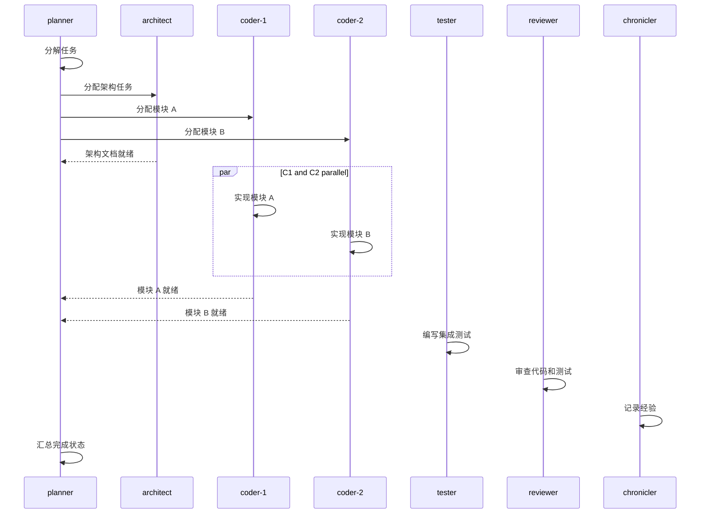

# 多角色 Git 冲突解决方案

> Hermes 多角色架构（planner, architect, coder, tester, reviewer, chronicler）下，多个角色可能在同一个仓库中并行工作，Git 冲突是不可避免的。本文档定义分层级的冲突预防与解决策略。

## 1. 架构层面的冲突预防

### 1.1 按角色隔离工作目录

每个角色只读写自己负责的目录，从源头减少冲突：

| 角色 | 写入目录 | 代码目录 | 冲突风险 |
|------|---------|---------|:-------:|
| planner | `docs/planning/`, `docs/requirements/` | 无 | 极低 |
| architect | `docs/architecture/` | 无 | 极低 |
| coder | `docs/implementation/` | `src/` | **高** |
| tester | `docs/testing/` | `tests/` | 中 |
| reviewer | `docs/review/` | 无 | 极低 |
| chronicler | `docs/lessons/` | 无 | 极低 |

**核心冲突面只在 coder × coder（多个 coder worker 改同文件）和 coder × tester（改同一行）。**

### 1.2 工作树（Worktree）隔离

```bash
# 每个角色/worker 有自己的独立工作树
git worktree add ../mergemate-coder-1 feature/coder-1
git worktree add ../mergemate-coder-2 feature/coder-2
git worktree add ../mergemate-tester-1 feature/tester-1
```

- 互不干扰的独立工作目录
- 共享同一个 `.git` 对象存储
- 无 stash、无 checkout 切换开销

**推荐配置：** 在 MergeMate 的配置模型中，每个 `WorkerConfig` 指定 `worktree_dir`：

```yaml
roles:
  coder:
    workers:
      - name: coder-1
        worktree: /home/pi/MergeMate/coder-1/
      - name: coder-2
        worktree: /home/pi/MergeMate/coder-2/
```

### 1.3 分支命名公约

```
<role>/<worker>-<short-description>
```

示例：
- `coder/coder-1-add-auth-flow`
- `coder/coder-2-refactor-models`
- `tester/tester-1-auth-tests`

每个 PR 只包含一个角色的工作。如果多个角色共同贡献同一个功能，使用 **集成分支**：

```
integration/planner-<epic-name>
        ↓
    feat-<epic-name>  (手动合并各角色分支)
```

## 2. 冲突解决策略（分层级）

### 层级 1：自动预防（推荐）

**条件**：角色写入非重叠区域

```
coder 修改 src/application/services/workflow_service.py
tester 修改 tests/application/test_workflow_service.py
```

→ 几乎零冲突风险。各角色在各自的 Git 工作树上工作，分别向 `main` 提 PR。

### 层级 2：Rebase 解决（低冲突）

**条件**：两个角色同时修改了同一文件的不同区域

```
coder 在第 50-80 行添加新函数
tester 在第 200-220 行添加测试
```

```bash
# 测试分支 rebase 到 main
git checkout tester/tester-1-auth-tests
git fetch origin main
git rebase origin/main
# 如果 git 自动合并成功 → 直接 push
git push --force-with-lease
```

**规则**：后完成者 rebase，先完成者先合并。

### 层级 3：三方合并策略（中等冲突）

**条件**：同一文件的相近行，逻辑不冲突

```bash
# 从 coder 的分支创建临时合并分支
git checkout coder/coder-1-auth-flow
git checkout -b merge/resolve-auth-and-refactor
git merge tester/tester-1-auth-tests
# 在 IDE 或手动解决冲突后
git commit -a -m "merge: resolve auth flow with refactored tests"
# 开 PR 从 merge/ 分支到 main
```

**谁来解决**：冲突涉及哪两个角色，就指定**其中一个角色**来解决。通常由 **coder** 解决，因为 coder 最了解代码逻辑。

### 层级 4：分解任务（高冲突预防）

**条件**：两个角色需要在同一文件的同一函数上工作

```diff
coder 需要重构 do_thing() 函数
tester 需要为 do_thing() 写测试
```

→ **不要并行**。将任务串行化：

1. 创建一个 `feat/refactor-do-thing` 分支
2. coder 先完成重构，push，合入 main
3. tester 再从最新 main 拉出 `feat/do-thing-tests` 分支写测试

```yaml
# 在 kanban 任务依赖中声明
tasks:
  - id: t_refactor
    assignee: coder
    description: "重构 do_thing()"
    depends_on: []  # 无依赖，先做
  - id: t_tests
    assignee: tester
    description: "为 do_thing() 写测试"
    depends_on: [t_refactor]  # 必须等重构完成
```

Kanban 依赖引擎自动阻止 `t_tests` 在 `t_refactor` 完成前进入 `ready` 状态。

## 3. 自动冲突检测与通知

### 3.1 在 PR 阶段检测

```bash
# 检查 PR 是否有冲突
curl -s -H "Authorization: Bearer $GITHUB_TOKEN" \
  "https://api.github.com/repos/djwinter29-oss/MergeMate/pulls/PR_NUMBER" \
  | python3 -c "import sys,json; d=json.load(sys.stdin); print(d.get('mergeable','unknown'))"
```

如果 `mergeable=False`，自动通知相关角色的 dispatcher：

```bash
hermes kanban create \
  --title "fix: resolve merge conflict in PR #XX" \
  --assignee coder \
  --body "PR #XX ($BRANCH) has merge conflicts with main. Rebase and fix." \
  --parents $ORIGINAL_TASK_ID
```

### 3.2 自动 Rebase 检查（预提交钩子）

在 `pre-push` 钩子中加入：

```bash
#!/bin/bash
# 检查当前分支是否落后 main
current=$(git rev-parse HEAD)
base=$(git merge-base HEAD origin/main)
if [ "$current" != "$base" ]; then
    behind=$(git rev-list --count origin/main..HEAD)
    if [ "$behind" -gt 3 ]; then
        echo "⚠️  Warning: Branch is $behind commits behind main."
        echo "   Consider rebasing: git rebase origin/main"
    fi
fi
```

## 4. 多角色冲突案例库

### 案例 A：两个 coder worker 修改同一个文件

```
worker-1: 在 service.py 第 10 行新增 import
worker-2: 在 service.py 第 15 行新增函数
```

```bash
# Git 自动合并成功（不同区域）
# 只做 merge commit，无手动解决
git checkout coder/coder-1
git merge coder/coder-2
git push origin coder/coder-1
```

### 案例 B：Coder 重构了 Tester 正在测试的函数

```
worker-1 (coder): 重命名 do_thing() → execute_task()
worker-2 (tester): 为 do_thing() 写新测试
```

→ Git 报冲突。手动解决：

```diff
<<<<<<< HEAD (coder)
def execute_task() -> None:
=======
def do_thing() -> None:
    # tester 新增的测试期望
>>>>>>> tester/tester-1
```

**解决方案**：保留 coder 的新函数名，更新 tester 的测试引用：

```python
def execute_task() -> None:
    # tester 新增的测试期望
```

### 案例 C：Tester 发现 bug 并修复（越界修复）

冲突场景：tester 在测试中发现问题，直接在 `src/` 里修了代码。这是**违反 Soul 边界**的行为。

**处理方式**：kanban 打回

```bash
hermes kanban block t_tester_bugfix \
  --reason "Tester modified src/ (Soul boundary violation). Creating coder task."
hermes kanban create \
  --title "apply bugfix from tester's findings" \
  --body "Tester found: ... Suggested fix: ..." \
  --assignee coder \
  --parents t_tester_bugfix
```

### 案例 D：多角色协作大型功能（epic）

```
planner:   分解任务，创建看板
architect: 设计架构，产生 docs/architecture/design.md
coder-1:   实现模块 A（src/module_a/）
coder-2:   实现模块 B（src/module_b/）
tester:    写测试（tests/module_a/, tests/module_b/）
reviewer:  审查所有产出
chronicler: 总结经验和坑
```



**Git 分支策略**：创建一个 `epic/<name>` 分支，所有角色在其自己的工作树中从该分支拉取、推送。

```
# 建立 epic 分支
git checkout -b epic/new-feature main
git push origin epic/new-feature

# 每个角色从 epic 分支创建自己的工作树
git worktree add ../mergemate-coder-1 epic/new-feature
git worktree add ../mergemate-coder-2 epic/new-feature

# 完成后以 squash merge 合入 main
git checkout main
git merge --squash epic/new-feature
git commit -m "feat: epic new-feature (co-authored by architect, coder-1, coder-2, tester)"
git branch -D epic/new-feature
```

## 5. 决策速查表

| 情况 | 策略 |
|------|------|
| 不同角色修改不同文件 | 各自 PR → main，按顺序 merge |
| 同文件不同区域 | Rebase + 自动合并 |
| 同文件相近行 | 手动三方合并，coder 优先解决 |
| 同文件同函数 | 串行化：先等 coder 完成，tester 再开始 |
| 多 worker 并行同角色 | 用 `sectioned` combine 策略，不直接写同文件 |
| 角色越界修代码 | kanban block + 重建给正确的角色 |
| Epic 级功能 | 共用 epic 分支 + worktree 隔离 |

## 6. 配置建议

在 MergeMate 的 config 中加入冲突预防相关设置：

```yaml
conflict_resolution:
  auto_rebase_on_pr: true                # 在创建 PR 前自动 rebase
  auto_detect_conflicts: true             # 在 kanban 中检测并创建修复任务
  default_resolver_role: coder            # 冲突时默认交给谁解决
  epic_branch_prefix: epic/               # epic 分支前缀
  worktree_base: /home/pi/MergeMate/      # worker 工作树根目录
  pre_push_check: true                    # 启用预推送检查
```